# Tạo Header dễ dàng với Flexbox và thuộc tính margin

HTML Ban đầu

```
header
  nav.nav
    ul.nav__list
      li > a > {Home}
      li > a > {About}
      li > a > {Blog}
      li > a > {Pricing}
      li > a > {Contact}
      li > a > {Login}
      li > a > {Sign up}
```

## Menu nằm ngang

### 1. CSS ban đầu

1.Hiển thị header mặc định sẽ như hình bên dưới:
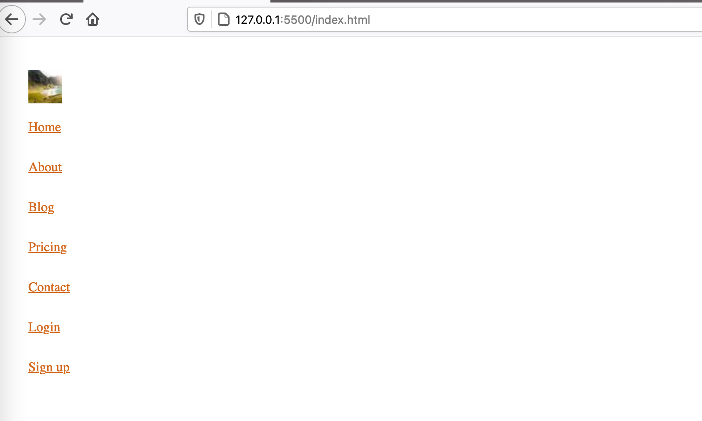

2.Cho header thuộc tính display có giá trị là flex

```
header {
  display: flex
}
```

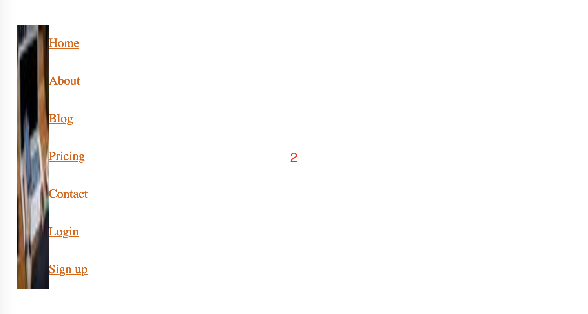

3.Cho ul.nav\_\_list có thuộc tính display có giá trị flex

```
nav__list{
  display: flex
}
```

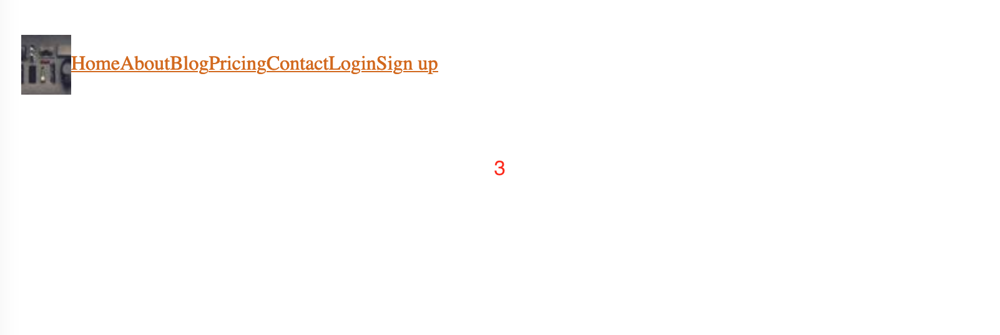

4.Nếu thuộc tính display của header không còn giá trị flex nữa thì:

```
header {
  display: block
}
```

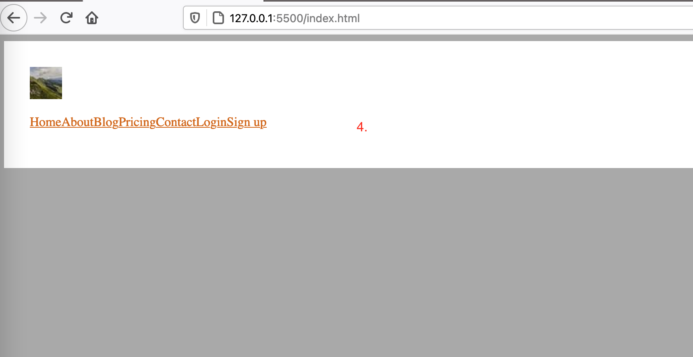

### 2. Dùng margin để điều khiển vị trí của các list item

Khởi đầu, vị trí của các item trên header như hình bên dưới:


1.Cho toàn bộ nav.nav chiếm 100% khoảng trống còn lại của header

```css
.nav {
  flex-grow: 1;
}
```

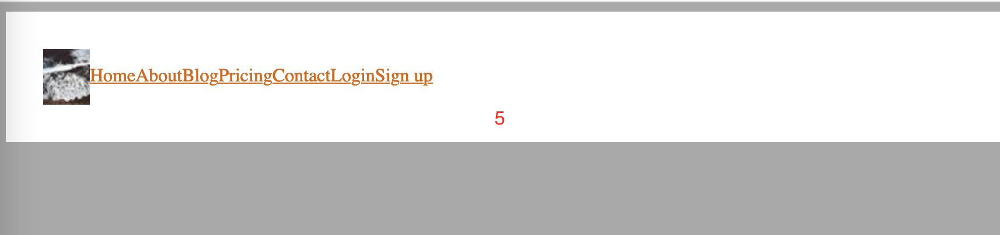

2.2 list item cuối tràn sang phải

```css
.nav__list li:nth-of-type(6) {
  margin-left: auto;
}
```

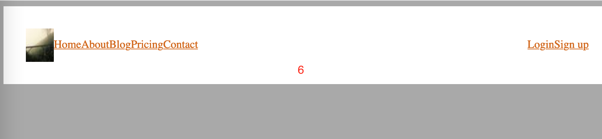

3.Khoảng cách giữa các item menu

```css
.nav {
  padding-left: 1em;
}
.nav__list {
  gap: 1em;
}
```

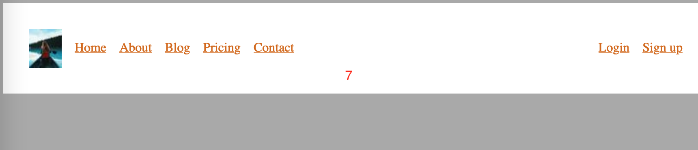

4.Căn giữa các list item còn lại

```css
.nav__list li:nth-of-type(1) {
  margin-left: auto;
}
```

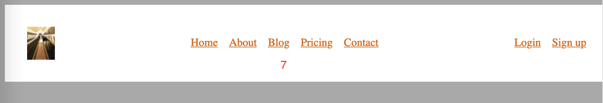

## Menu nằm dọc

### 1. CSS ban đầu

1.Cho header fixed bên trái

```css
header {
  position: fixed;
}
```

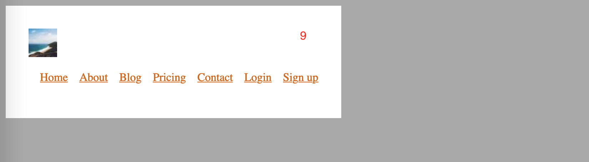

2.Cho header chiếm toàn bộ bên trái màn hình

```css
header {
  position: fixed;
  left: 0;
  top: 0;
  bottom: 0;
}
```

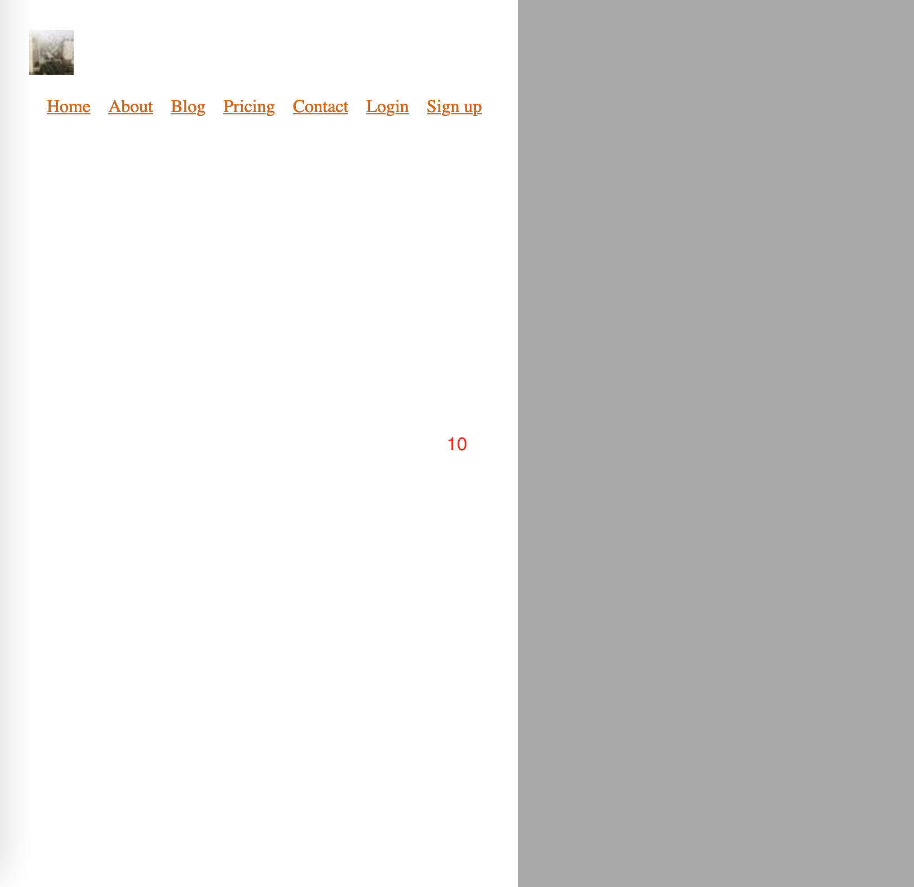

3.Cho ul.nav\_\_list chiếm 100% chiều dọc của header

```css
header {
  display: flex;
  flex-direction: column;
}
nav.nav {
  flex-grow: 1;
}
.nav__list {
  height: 100%;
}
```

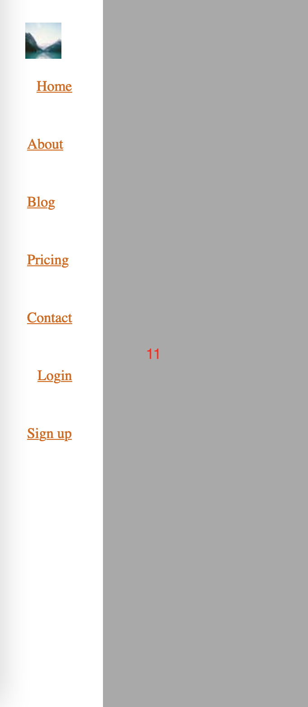
4.Cho các list item hiển thị theo hàng dọc

```css
.nav__list {
  flex-direction: column;
}
```


5. Dùng margin điều khiển vị trí của các list item

```css
.nav__list li:nth-of-type(6) {
  margin-top: auto;
}
```

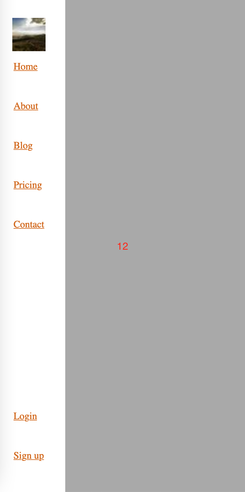
