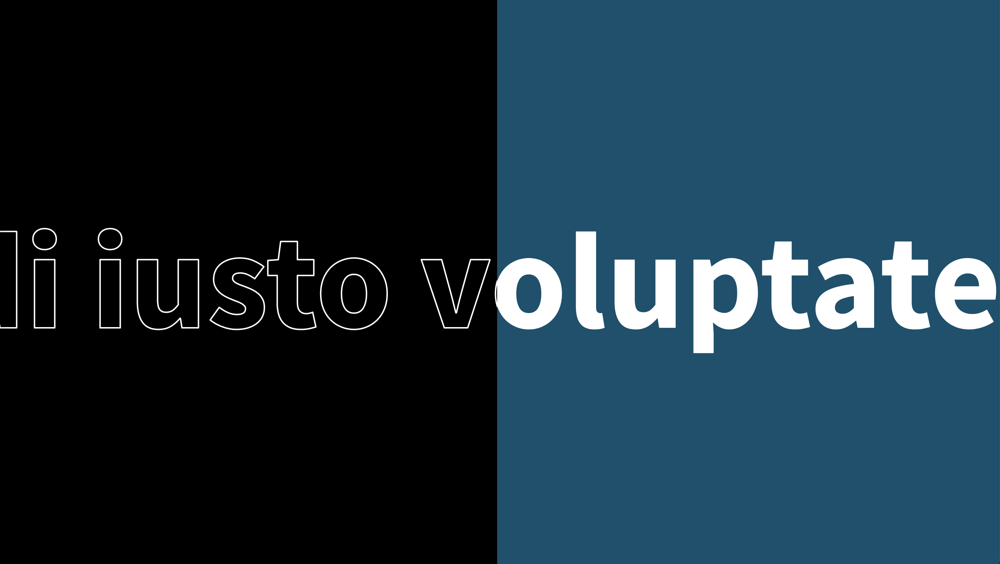

# Banner text scrolling animation



## import google fonts

```css
@import url("https://fonts.googleapis.com/css?family=Source+Sans+Pro:300,400,600,700,900&display=swap");

body {
  font-family: "Source Sans Pro", sans-serif;
}
```

## HTML

```
section
  div
    h2>Lorem

  div
    h2>Lorem
```

## CSS

### Mô tả:

- 2 div h2 cùng 1 nội dung.
- 2 div h2 cùng chạy sang trái vào cùng thời điểm và tốc độ.
- Nền và định dạng h2 của div 1, khác với nền và định dạng h2 của div 2.
  => Tạo cảm giác chữ chạy xuyên suốt từ div 2 sang div 1.

### Các bước thực hiện

Định dạng cho section: full màn hình, 2 item bên trong nằm ngang nhau (display:flex)

```css
section {
  position: relative;
  width: 100%;
  height: 100vh;
  display: flex;
  overflow: hidden;
}
```

Mỗi div chiếm 50% màn hình, phần thừa ẩn đi
div 1 có bg màu đen, div 2 có màu xanh

```css
section div {
  width: 50%;
  overflow: hidden;
  background: #20506b;
  position: relative;
}
section div:nth-child(1) {
  background: #000;
}
```

Tiêu đề h2: căn giữa màn hình theo chiều dọc, không xuống dòng.

```css
section div h2 {
  font-size: 25em;
  line-height: 100vh;
  white-space: nowrap;
}
```

Tiêu đề h2 của div 1: left 100%, sau đó animation cho chạy từ left 100% đến left -100%. Và định kiểu chữ dạng stroke

```css
section div:nth-child(1) h2 {
  -webkit-text-stroke: 2px;
  -webkit-text-stroke-color: #fff;
  -webkit-text-fill-color: transparent;
  left: 100%;
}
```

Tiêu đề h2 của div 2: màu chữ trắng, left nằm ở vị trí 0, dùng chung animate với h2 của div 1

```css
section div:nth-child(2) h2 {
  color: #fff;
}
section div h2 {
  animation: animate 60s linear infinite;
}
@keyframes animate {
  0% {
    transform: translateX(0);
  }
  100% {
    transform: translateX(-100%);
  }
}
```
